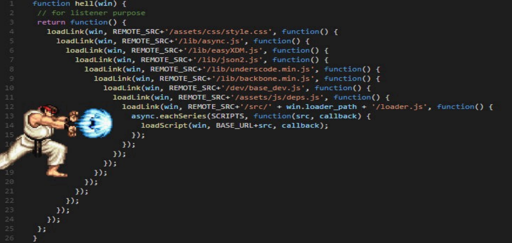

# sTÍTULO: Callbacks y promesas

## EL PROBLEMA:

Al escribir código asíncrono, tendremos que definir funciones que se ejecuten al finalizar un proceso o una llamada asíncrona, a esto se les denomina callbacks, pero si desarrollamos con este enfoque podremos caer en el problema del conocido callback hell.

Para evitar el callback hell, podremos usar promesas para no anidar de manera tan profunda.

## PREGUNTAS:

* ¿Por qué evitar los callbacks en las llamadas asíncronas?
  * código enredado por la anidacion excesiva.
  * dificil entendimiento.
  * falta de legibilidad.
  * dificil manejo de errores.
  * dificil control del frujo.
* ¿Qué es una promesa?
  * Una promesa es un objeto de programacion asincronico, que representa eventualmente el fracaso o exito de una operacion asincronica.
  * Una promesa permite escribir codigo asincronico de manera mas legible y manejable.
* ¿Qué es el callback hell?
  * tambien llamado "infierno de callback", se utiliza para describiri una situacion en la programacion asincronico donde se anidan múltiples callbacks de manera excesiva y se produce un código difícil de leer, mantener y depurar.
